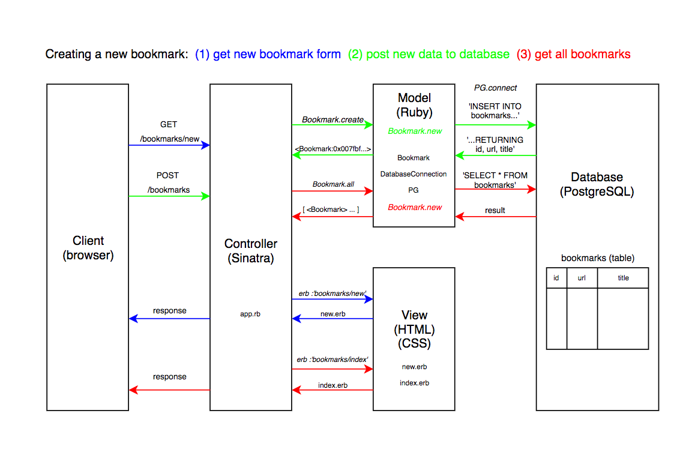

# bookmark_manager

## User Stories

```
As a busy user
So I can quickly go to my websites
I want to see a list of bookmarks

As a busy user
So I can remember a great site
I want to create bookmarks

As a user
So I can remove my bookmark from Bookmark Manager
I want to delete a bookmark

As a user
So I can change a bookmark in Bookmark Manager
I want to update a bookmark

```

## Domain Model



## How to use

### To set up the project

Clone this repository and then run:

```
bundle
```

### To set up the database

Connect to `psql` and create the `bookmark_manager` and `bookmark_manager_test` databases:

```
CREATE DATABASE bookmark_manager;
CREATE DATABASE bookmark_manager_test;
```

To set up the appropriate tables, connect to each database in `psql` and run the SQL scripts in the `db/migrations` folder in the given order.

### To run the Bookmark Manager app:

```
rackup
```

To view bookmarks, navigate to `localhost:9292/bookmarks`.

### To run tests:

```
rspec
```

### To run linting:

```
rubocop
```
